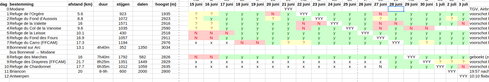

# Alpine Mountain Hut API (AMH-API)

## Motivation

### Problem Statement

The Alps have hundreds of mountain huts. Most require upfront reservation to spend the night, but there is no single reservation system. Reservation systems are (highly) fragmented, due to huts being located in different countries, being owned by different organizations (Alpine clubs, national parks, private owners, ...).

### Existing Solutions

A number of people have already created web apps that bring together information from different reservation systems, such as:

  - crawlers
    - [hutfinder.app](https://hutfinder.app/) crawls hut-reservation.org
    - [refugesdesalpes.com](https://refugesdesalpes.com/) crawls FFCAM & SAC
    - [Nuit en Montagne](https://www.nuit.en-montagne.fr/) crawls FFCAM (source code on [GitHub](https://github.com/maxenceprog/nuit-en-montagne/tree/main))
    - [madetohike.com](https://madetohike.com/hut-map) vibe-coded web crawler (contains duplicate entries, errors). Only 'static' data.
    - [Mont Blanc Refuge Availability Checker](https://github.com/AlexYaroshenko/montblanc/tree/main)
  - community hut databases (only 'static' data)
    - [mountainhuts.info](http://www.mountainhuts.info/map) huts all over Europe, including Eastern-Europe.
    - [refuges.info](https://www.refuges.info/) mostly French huts. Public (documented) API.

However:

  - Each has only a subset of mountain huts, and there is **no obvious way of contributing**.
  - They all **re-implement** some part of the same **boring** data aggregation/federation functionality!
  - None of them offer the UI that I want (see Epilogue ...)

Hence, the need for an open-source, **collaborative** effort to creating a **federated API** that anyone can use, extend, and easily run on their own machines.

## Goal

The main purpose of this project is to build a single REST API that brings together information on as many Alpine mountain huts as possible, most importantly **reservation status information**.

## Implementation

 - All information is fetched **lazily** and **extensively cached**
     - to minimize load on our data sources (we don't want to get banned)
     - caching minimizes latency and load:
        - requests to data sources are cached in the service
        - responses to clients:
            - have the 'Cache-Control' header properly set (so browsers will automatically cache them correctly)
            - have a data field (in JSON) indicating how old the information is - this can be shown to the end-user.
        - cache duration is configurable. Defaults are:
            - 4 hours for static data
            - 5 minutes for reservation status
                 - there's also an endpoint to 'force refresh' this information to get the latest version no matter what.
 - The entire service (including the cache) runs **in-memory**.
     - because we can: all collected information on *all* mountain huts would only consume a couple of megabytes! (let's say 100 MB at most)
     - it **simplifies deployment**: no need to set up a file system or database. It should be easy for anyone to host an instance of this API (no single point of failure).
     - (it's also fast and easy to implement!)

### Data sources

Currently, two data sources have been implemented:

 - [hut-reservation.org](https://hut-reservation.org/) has a public API with *all* the mountain huts from OEAV (Austria), DAV (Germany), SAC (Switzerland), AVS (South-Tyrol).
    - Note: to use this API, you need to [authenticate](./src/data-sources/hut-reservation.org/config.ts) with a (free) account.
 - [ffcam.fr](https://ffcam.fr) does not have a public API, so I crawl the HTML of their booking wizard and also another web page of theirs listing all huts. No account is necessary to for this data source.

What's missing:

 - **France** has many private (non-FFCAM) huts as well. Some (e.g., in the Vanoise parc) all use a single booking system, so it's quite realistic that a bunch more will be added soon.
    
    The following page gives a nice overview of huts in different parts of France: https://www.gites-refuges.com/www/centrale_reservation.htm

 - **Italy**: I have to check what kind of reservation system(s) exist there.

 - **private huts** in Austria, Germany, Switzerland, South-Tirol (although there aren't that much).

## Running

1. Install [bun](https://bun.com).
2. Install dependencies: `bun i`
3. Run the API: `bun src/main.ts`

## API Documentation

The API is not yet stable. For now, have a look at the TypeScript definitions in [types.ts](./src/types.ts) to get an idea of what information is currently being offered.

## Contributing

Contributions are welcome!

Also, if you have any feedback, ideas or other inquiries, don't be shy to:
  - create an issue
  - [e-mail me](mailto:joeri.exelmans@gmail.com)

## Epilogue: My 'cunning plan' ...

When planning a hut-to-hut trip, I usually visit all the different reservation websites manually and collect information about hut availability in a spreadsheet, like so:

It shows the availabilities of every hut in a wide time range. A diagonal of available huts corresponds to a "bookable" trip.

This, I believe, is the most convenient way of booking a hut-to-hut trip, because not only does it show me ***if*** some trip is possible, but also ***why*** some trip is *not* possible: for instance, maybe one of the huts is always completely booked, and by skipping that one hut, I can still take the trip.

No existing app can create such a table for me.
I really just want to create a web app that automatically generates this table if I fill in the names of the huts...
